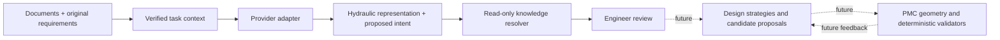

# V2.2 AI Design Layer — foundation

The product goal is an editable, validated manifold proposal derived from a hydraulic schematic **and the engineer's requirements**. This delivery establishes hydraulic understanding and review. It does not select cartridges, size blocks, place components, drill holes, calculate cost or modify CAD.

## Working flow

Open **AI Design** from Projects or the design toolbar. Create an analysis, add one or more PDF/PNG/JPEG files, and enter engineering requirements. Existing project schematics can be reused without modifying that project. Save inputs, then run a local mock. No provider credentials or network access are required.

- **mock-safe** interprets a deliberately small set of requirement patterns and leaves schematic contents unresolved. It performs no OCR.
- **mock-example** returns an explicitly synthetic relief-valve circuit, with an unresolved SUN RDBA-LAN knowledge lookup. It is never presented as recognition of an arbitrary upload. The bundled sample has a known hash; only that sample receives its fixture's document location.
- Review components, component/external ports, nets, proposed requirements, unresolved questions and knowledge lookups. Source buttons open exact instruction spans or document/page references. Image boxes use normalized page coordinates. PDF references open the original file at the indicated page; PDF rasterization/OCR is not implemented.
- Confirm, correct or reject individual claims with a decision. The original model result and original user text remain unchanged. Export analysis JSON for inspection. This export is a `pmc-ai-analysis` packet, **not** a `.pmc.json` manifold Design.

## Boundaries and extension path

The AI package has no call to a geometry builder, route generator or library write function. Existing CAD and knowledge/library work remain authoritative for cavities, compatibility, standards, wall thickness, intersections and manufacturing checks. An LLM's proposed rating or cavity association is not an authoritative source.

`AnalysisRequest` carries the operation, contract version, typed inputs, original requirements, verified document bytes, target result schema and an instruction boundary. A provider adapter translates this envelope into its vendor's request and translates the response back. Provider IDs, models, supported media and mock status are advertised by the backend; the UI discovers them. No vendor prompt syntax, API key, endpoint URL or response object enters the hydraulic domain model. Only local mocks are registered today; model names in this release make no claim about current vendor availability or pricing.

The same context/schema boundary can support later operations such as design-strategy proposals or comparison of already validated candidates. Those stages need their own admission contracts; they must not bypass the deterministic Design/CAD APIs. A future agent may consume validator feedback and propose a revision, but the application must retain revision checks and engineering approval boundaries.

## Hydraulic contract

`HydraulicRepresentation.schema_version = 1` is separate from the existing `Design.schema_version = 1`.

| Element | Purpose |
|---|---|
| Components | Stable semantic IDs, owned port IDs and attributed claims; no mandatory model, cavity or placement |
| Ports | Component ports or external manifold terminals; labels/roles are claims, IDs remain independent |
| Nets | Port membership and a connection claim that records the provenance and uncertainty of topology |
| Claims | Subject, predicate, scalar value or null, unit, information kind, status, optional confidence, alternatives, explanation and evidence IDs |
| Evidence | Source kind, document ID/page/normalized box, quote, exact original-instruction span, or versioned knowledge reference |
| Design intent | Category, target labels, property, operator, strength and interpreted claim; explicit entity bindings remain empty until resolved |
| Unresolved items | Missing, ambiguous, conflicting, unsupported and knowledge-unavailable information without forcing invented completeness |
| Knowledge lookups | Component/model requests, resolution status and versioned source candidates |

Component functional types, manufacturer/model, labels, pressure/flow, settings, orifices, coils, electrical values and additional engineering parameters are expressed as claims. This avoids a geometry-oriented component schema forcing premature choices. Units remain explicit; an extracted value is not silently converted or treated as a machining dimension.

Information kinds distinguish `schematic`, `user_requirement`, `knowledge_base`, `ai_inference`, `unknown` and the additional testing-only `mock_fixture`. Inference may cite schematic/user evidence while retaining inference provenance. Unknown claims use null, not a fabricated value. Confidence is nullable; the mocks do not invent a numeric confidence. Model statement status and engineer review status are separate.

Original engineering requirements are stored verbatim in each input snapshot. Interpreted intent is separately inspectable. For example, “Maximum block width 150 mm” becomes an envelope/width/maximum intent with a 150 mm claim and an exact span pointing back to the original sentence. Target labels such as P1/P2 are not implicitly bound to CAD IDs. Unsupported mock clauses remain unresolved and their original text is retained. This is a small test grammar, not a claim of general natural-language understanding.

## Validation and trust

Pydantic forbids extra fields and non-finite numbers, bounds sizes, validates global entity identities, port ownership, net membership, connection provenance, claim references, source boxes and confidence. Context admission verifies source document IDs, known page bounds and exact requirement quotes/spans. Uploaded bytes are checked against their SHA-256 and media identity before every analysis. Limit: 20 documents, 20 MB each, 100 MB aggregate; result JSON is capped at 2 MB.

The model cannot declare Knowledge Base matches or supply knowledge-base claims. Only the resolver boundary may do so. The current resolver returns unresolved responses and never reads, copies, migrates or writes the separate Knowledge Base or converted libraries. A future resolver must return stable record IDs, revisions and hashes, preserve native identities, and define which fields are authoritative. A missing manufacturer/model remains a legal lookup; it does not stop circuit analysis.

Documents are untrusted evidence rather than instructions to execute actions. The request carries this distinction, and the result contract contains no tool calls or CAD commands. Current providers have no network transport. Future adapters must keep credentials server-side and enforce media capabilities, timeouts, output limits and bounded error classification. Raw remote response/error bodies are not written to failure records or returned in errors. Token/cost metrics remain null unless reported; latency is measured locally. Accuracy and multimodal capability still need evaluation on real models.

## Local persistence and API

- Reuse the existing `/api/assets` upload and content-addressed asset store.
- Analysis workspaces live under ignored `projects/ai-design/<id>.json`; optimistic revisions cover inputs, history pointers and engineer decisions. Input/history writes reuse the application's lock and atomic JSON writer.
- Every attempt stores an immutable input/result envelope under ignored `output/ai-design/<task>/<run>.json`. The mutable workspace holds the last 100 run summaries and the latest successful pointer; immutable files and workspace history are retained.
- A run uses a snapshot. If the workspace changes while it executes, its evidence is retained, but the API returns a conflict and leaves the newer workspace untouched. Failed runs preserve the previous successful result. Changed inputs mark prior results stale.
- Reviews are per run and claim, use compare-and-swap, and record an engineer decision and timestamp. They overlay, rather than rewrite, extracted values. Reviewing a model number does not automatically resolve a new Knowledge Base match or silently close other questions.

| API | Responsibility |
|---|---|
| `GET /api/ai-design/providers`, `/schema` | Capabilities and versioned result contract |
| `GET/POST /api/ai-design/tasks` | List or create/update inputs |
| `GET /api/ai-design/tasks/{id}` | Workspace/revision/staleness |
| `POST /api/ai-design/tasks/{id}/analyze` | Run the selected registered adapter |
| `GET /api/ai-design/tasks/{id}/runs/{run}` | Immutable result and input snapshot |
| `POST .../runs/{run}/review` | Revision-checked engineer decisions |
| `GET .../{id}/export` | Inspectable analysis packet; document binaries remain separate |

These routes inherit the existing local/LAN host, same-origin, request-header and body-size controls. An optional linked project ID is metadata only. V1's schematic/component mapping, project import/export, builds and legacy Codex handoff remain available and separate.

## Known debt and next step

1. The current service is synchronous. Real adapters need transport timeouts; long analyses should move behind durable jobs/cancellation without changing the domain contract.
2. PDF upload currently reuses the existing signature checks. Structural PDF validation, page rasterization, orientation transforms, OCR and PDF region overlays are future document-adapter work. Unknown page counts are not invented.
3. The mock requirement grammar covers selected English examples; it does not understand general instructions. Unsupported text is retained and flagged. The UI supports claim review; graph/topology editing, ambiguity resolution and review-driven knowledge re-query are not implemented.
4. Source claims are schema/context checked, not semantically proven. A provider can still misread a real image; human review and a labeled evaluation set are necessary. A typed, versioned predicate vocabulary can be added when real schematic samples establish it.
5. Run JSON export is inspectable; cross-machine import/asset packaging, retention policies and richer analysis management remain future work. Existing full frontend bundle-size warnings remain.

Recommended next V2.2 stage: build a small, labeled multi-page schematic evaluation set with expected source boxes and requirement interpretations; implement one document-capable adapter behind this interface; compare recognition, uncertainty calibration, structured-output failures, latency and reported cost. Integrate a read-only resolver when the separate Knowledge Base contract is ready. Do not start full automatic manifold generation in that stage.
